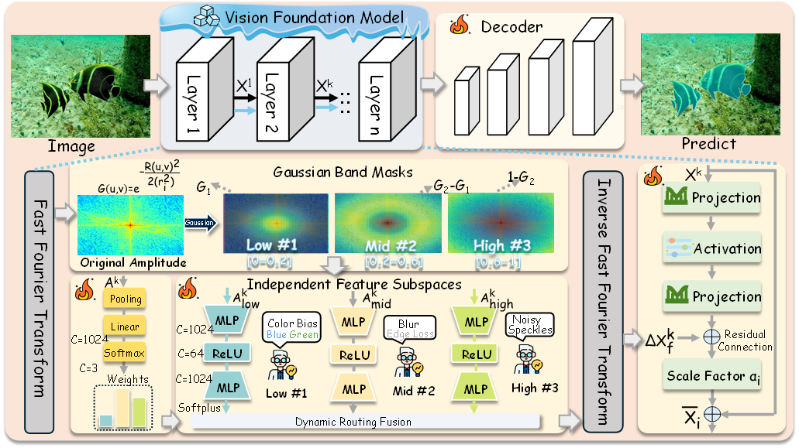

# [ACM MM 2026] BDA: Learning a Band-Decomposed Adapter for Underwater Instance Segmentation


## 📚 Introduction
Official implementation of **BDA**, a band-decomposed adapter designed for underwater instance segmentation.

## 📖 Abstract
Fine-tuning vision foundation models (VFMs) has become the dominant paradigm for underwater instance segmentation (UIS), yet existing methods overlook the fact that underwater degradation further aggravates the confusion between target instances and visually cluttered backgrounds, a challenge that general adaptation strategies fail to address effectively. Although frequency-domain style alignment methods have shown some promise, they typically apply uniform operations across the entire spectrum. In contrast, we find that the effects of different degradations are concentrated in different frequency bands of the amplitude spectrum, making band-decomposed correction a more reasonable strategy. Based on this, we propose Band-Decomposed Adapter (BDA), a parameter-efficient fine-tuning method. Specifically, BDA employs Gaussian functions to partition the amplitude into multiple frequency bands and constructs an independent subspace for each band to perform targeted degradation correction. Furthermore, we design a dynamic routing mechanism that adaptively allocates the contribution of each frequency band according to the global amplitude distribution, thereby enabling robust handling of mixed degradations. Extensive experiments on UIIS and USIS10K show that BDA consistently outperforms existing state-of-the-art methods, validating the effectiveness of band-decomposed frequency-domain adaptation for UIS. 

## 🏗️ Architecture
<p align="center">
  
</p>

## 🛠️ Installation

```bash
conda create --name BDA python=3.10 -y
conda activate BDA

conda install pytorch==2.1.0 torchvision==0.16.0 torchaudio==2.1.0 \
    pytorch-cuda=12.1 -c pytorch -c nvidia

# Install Detectron2
git clone https://github.com/facebookresearch/detectron2.git
cd detectron2
pip install -e .

# Install BDA
cd ..
git clone https://github.com/Marinus47/BDA.git
cd BDA
pip install -r requirements.txt

# Compile the Mask2Former CUDA operator
cd mask2former/modeling/pixel_decoder/ops
sh make.sh
cd ../../../..
```

## 📁 Project Structure

The repository is organized as follows:

```text
BDA/ [Underwater Instance Segmentation Framework]
├── checkpoints/                  # Pre-trained and trained model weights
│
├── configs/                      # Experiment configuration files
│   ├── UIIS/                     # Configurations for UIIS
│   └── USIS10K/                  # Configurations for USIS10K
│
├── data/                         # Dataset root
│   ├── UIIS/
│   │   ├── train/
│   │   │   ├── images/
│   │   │   └── annotations/
│   │   └── val/
│   │       ├── images/
│   │       └── annotations/
│   │
│   └── USIS10K/
│       ├── train/
│       ├── val/
│       ├── multi_class_annotations/
│       ├── foreground_annotations/
│       └── test/
│       
├── datasets/                     # Dataset preparation scripts
│   ├── prepare_ade20k_ins_seg.py
│   ├── prepare_ade20k_pan_seg.py
│   ├── prepare_ade20k_sem_seg.py
│   └── prepare_coco_semantic_annos_from_panoptic_annos.py
│
├── mask2former/                  # Mask2Former implementation
│   ├── data/                     # Dataset registration and data loaders
│   ├── evaluation/               # Evaluation metrics
│   ├── modeling/                 # Model components
│   ├── utils/                    # Utility functions
│   ├── __init__.py
│   ├── config.py                 # Configuration definitions
│   ├── maskformer_model.py       # Main segmentation model
│   └── test_time_augmentation.py # Test-time augmentation
│
├── tools/                        # Model conversion and evaluation tools
│   ├── convert-pretrained-swin-model-to-d2.py
│   ├── convert-torchvision-to-d2.py
│   ├── evaluate_coco_boundary_ap.py
│   ├── evaluate_pq_for_semantic_segmentation.py
│   └── README.md
│
├── .gitignore
├── eval.sh                       # Evaluation script
├── LICENSE
├── README.md
├── train.sh                      # Training script
└── train_net.py                  # Main training and evaluation entry
```
---

## 📥 Datasets and Pre-trained Weights

The pretrained DINOv2 weights are available from the official [DINOv2 repository](https://github.com/facebookresearch/dinov2). We use the DINOv2 ViT-L/14 model without registers.

The datasets can be downloaded from the following repositories:

- [UIIS Dataset](https://github.com/LiamLian0727/WaterMask)
- [USIS10K Dataset](https://github.com/LiamLian0727/USIS10K)

After downloading, please organize the datasets according to the directory structure described above.

---

## 🚀 Train & Evaluate

Train the BDA model on the UIIS or USIS10K dataset:

```bash
bash train.sh
```

Evaluate the pretrained BDA models on the test sets:

```bash
bash eval.sh
```

The expected performance is summarized below:

| Dataset | Test Setting | Backbone | $mAP$ | $AP_{50}$ | $AP_{75}$ | Weights |
|:-------:|:------------:|:--------:|:-----:|:---------:|:---------:|:-------:|
| UIIS | Instance | ViT-L | 36.7 | 52.4 | 40.8 | [model](https://drive.google.com/file/d/1JPuOoblSen9anskgwYfPU4g4cxjcZ6Ai/view?usp=sharing)|
| USIS10K | Class-Agnostic | ViT-L | 66.0 | 84.2 | 73.9 | [model](https://drive.google.com/file/d/1gdn0tOGZLIdGheVR6hLm8evANJ6dT7Uz/view?usp=sharing) |
| USIS10K | Multi-Class | ViT-L | 50.8 | 65.3 | 56.2 |[model](https://drive.google.com/file/d/13L0O6eTkxDrcz8bhSorsd8bu7eRgguft/view?usp=sharing) |

---

---

## 🙏 Acknowledgement

This project is built upon [DiveSeg](https://github.com/ettof/Diveseg), [DINOv2](https://github.com/facebookresearch/dinov2), and [Mask2Former](https://github.com/facebookresearch/Mask2Former). We sincerely thank the authors for their excellent work and for making their code publicly available.
